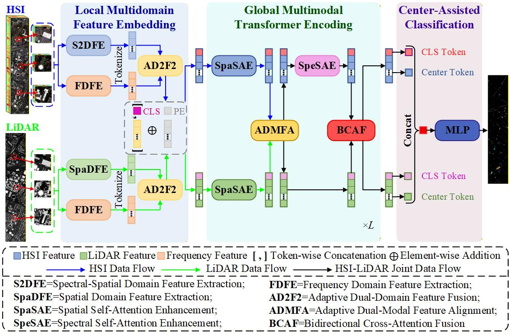
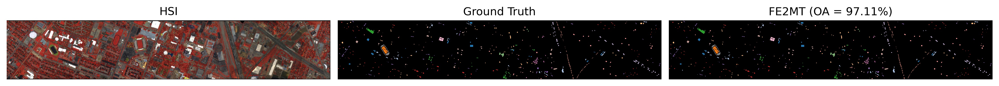
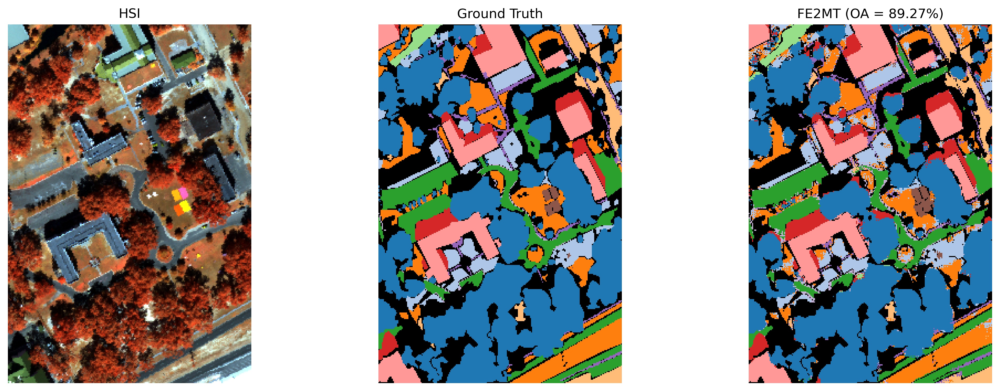
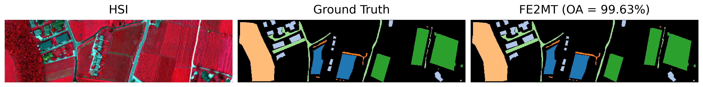

# FE2MT

## Frequency-Enhanced Embedding Multimodal Transformer for Collaborative Classification of Hyperspectral and LiDAR Data

> **Paper Status:** Under Review

FE2MT is a frequency-enhanced multimodal Transformer framework for collaborative classification of hyperspectral imagery (HSI) and LiDAR data. The framework jointly exploits local multidomain representations and global multimodal interactions to improve complementary feature learning across heterogeneous modalities.

Specifically, FE2MT first constructs modality-specific spatial or spectral-spatial representations together with frequency-domain features extracted through wavelet decomposition. These complementary representations are adaptively integrated to form enhanced HSI and LiDAR token embeddings. Subsequently, a multimodal Transformer encoder progressively performs spatial self-attention enhancement, adaptive dual-modal feature alignment, spectral self-attention enhancement, and bidirectional cross-attention fusion. Finally, global CLS representations and target-pixel local tokens from both modalities are jointly utilized for classification.

## Framework

<p align="center">
  
</p>

<p align="center">
  Overall architecture of the proposed FE2MT.
</p>

## Datasets

Experiments are conducted on three widely used HSI--LiDAR datasets: Houston2013, MUUFL, and Trento.

The datasets should be organized as follows:

```text
data/
├── Houston2013/
│   ├── hsi.mat
│   ├── lidar.mat
│   └── gt.mat
├── MUUFL/
│   ├── hsi.mat
│   ├── lidar.mat
│   └── gt.mat
└── Trento/
    ├── hsi.mat
    ├── lidar.mat
    └── gt.mat
```

The variables stored in the MAT files should be named `HSI`, `LiDAR`, and `gt`, respectively.

## Requirements

* Python 3.13.2
* PyTorch 2.7.1
* CUDA 12.8
* NumPy 2.2.6
* SciPy 1.16.1
* scikit-learn 1.7.1
* Matplotlib 3.10.0

Install dependencies:

```bash
pip install -r requirements.txt
```

## Project Structure

```text
FE2MT/
├── data/
├── figures/
│   ├── framework.jpg
│   ├── houston_result.jpg
│   ├── muufl_result.jpg
│   └── trento_result.jpg
├── data_loader.py
├── fe2mt.py
├── train.py
├── visualize_results.py
├── requirements.txt
├── README.md
└── .gitignore
```

## Usage

### Houston2013

```bash
python train.py --dataset_root data/Houston2013
```

### MUUFL

```bash
python train.py --dataset_root data/MUUFL --train_per_class 60
```

### Trento

```bash
python train.py --dataset_root data/Trento
```

Experimental configuration:

* Training samples per class: 20 for Houston2013 and Trento, 60 for MUUFL
* Patch size: 16
* Embedding dimension: 128
* Transformer depth: 4
* Number of attention heads: 8
* Batch size: 64
* Optimizer: Adam
* Learning rate: 1e-4
* Learning rate scheduler: CosineAnnealingLR (minimum learning rate: 1e-6)
* Number of runs: 10

## Results

The quantitative results are reported as the mean and standard deviation over 10 independent runs.

| Dataset     |       OA (%) |       AA (%) |    Kappa (%) |
| ----------- | -----------: | -----------: | -----------: |
| Houston2013 | 96.54 ± 0.66 | 96.99 ± 0.52 | 96.26 ± 0.71 |
| MUUFL       | 89.67 ± 0.64 | 89.84 ± 0.48 | 86.49 ± 0.80 |
| Trento      | 99.20 ± 0.37 | 98.71 ± 0.41 | 98.93 ± 0.49 |

## Classification Maps

<p align="center">
  
</p>

<p align="center">
  Classification result on the Houston2013 dataset.
</p>

<p align="center">
  
</p>

<p align="center">
  Classification result on the MUUFL dataset.
</p>

<p align="center">
  
</p>

<p align="center">
  Classification result on the Trento dataset.
</p>
